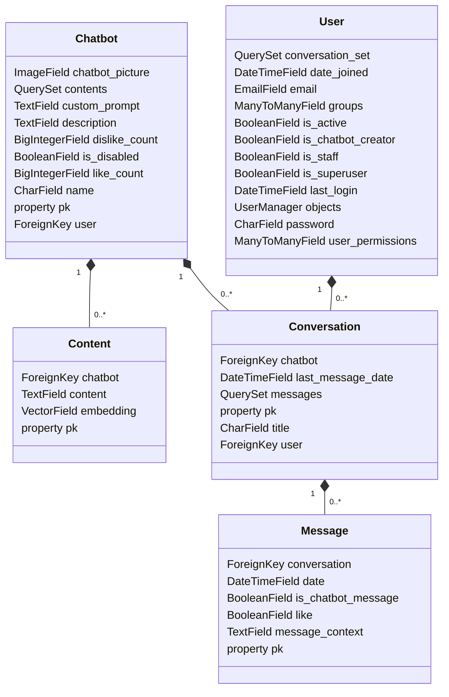

# chatbot
chatbot is a project for creating your own chatbot with custom prompt and contents

## technologies
Django  
Postgresql  
PgVector  
Pillow  
Docker

## test RAG efficiency
- ``` bash
   python manage.py test_rag_efficiency
  ```

## OpenAI API Integration

This project utilizes the OpenAI API for creating embeddings and answering client questions. To use the OpenAI API with this project, follow these steps:

1. **API Key:**
   - Obtain an API key from [OpenAI's website](https://openai.com/).
   - Copy your API key.

2. **Configuration:**
   - Create a env file (e.g., `config.env`) and set your OpenAI API key:

     ``` .env
     OPENAI_API_KEY=your-api-key
     ```

## Run the Project:
- config postgresql database in .env file
    ``` .env
    SQL_ENGINE=django.db.backends.postgresql
    SQL_DATABASE= your-database-name
    SQL_USER= your-database-user-name
    ```
- run the project
    ``` bash
    python manage.py runserver
    ```

## Usage

To use this project, follow these steps:

### 1. Set Up a Chatbot

- Create a chatbot as an admin or a user with the `chatbot_creator` staff role.
  - As an admin, you can create a chatbot from the Django admin interface.
  - For staff users with the `chatbot_creator` role, use the management command or provide the necessary permissions to create chatbots.

### 2. Add Content to the Chatbot

- Once the chatbot is created, add content to enhance its responses.
  - Use the Django admin interface to manage and add content to your chatbot.
  - Content may include predefined responses, conversation starters, or any relevant information.

### 3. Interact with the Chatbot

- Clients can create conversations with your chatbot and engage in conversations.
  - Conversations can be initiated through the user interface or an API endpoint, depending on your project's design.
  - The chatbot will respond based on its predefined content and any learning mechanisms implemented.

## Continuous Integration/Continuous Deployment (CI/CD)

This project uses a CI/CD pipeline to automate the testing and deployment process. The pipeline is configured with Gitlab pipeline.

## Project Structure

This project follows the Django MVT (Model-View-Template) architecture.

project models diagram:


 ## Licence
This code is released under the [MIT License](LICENSE).

