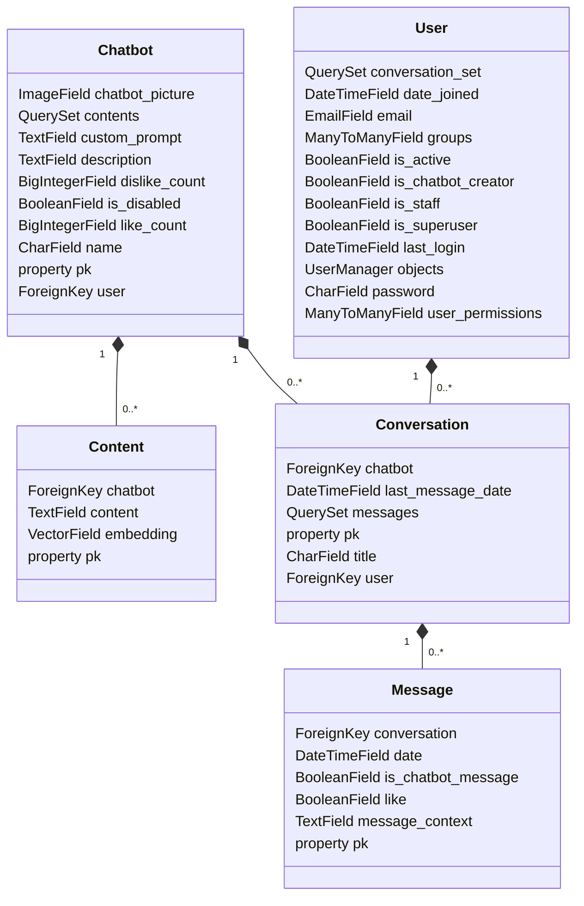

# chatbot
The chatbot project is designed to empower users to create their own chatbot with a custom prompt and content.
By integrating advanced natural language processing techniques,
this project leverages Retrieval Augmented Generation (RAG) and OpenAI's ChatGPT to provide a more context-aware and informative conversational experience.

### Customization
**User-defined Prompts** : Users can add their own custom prompts, tailoring the chatbot's behavior to specific needs or industries.

**Custom Content**: The project supports the inclusion of custom content to expand the knowledge base, enabling the chatbot to provide more accurate and personalized responses to clients.

## technologies
Django  
Postgresql  
PgVector  
Pillow  
Docker


## OpenAI API Integration

This project utilizes the OpenAI API for creating embeddings and answering client questions. To use the OpenAI API with this project, follow these steps:

1. **API Key:**
   - Obtain an API key from [OpenAI's website](https://openai.com/).
   - Copy your API key.
   - 
2. **API Key:**
   - Obtain an API key from [OpenAI's website](https://openai.com/).
   - Copy your API key.

3. **Configuration:**
   - Create a env file (e.g., `config.env`) and set your OpenAI API key:

     ``` .env
     OPENAI_API_KEY=your-api-key
     OPENAI_BASE_URL=your-base-url
     ```

## Run the Project:
- config postgresql database in .env file
    ``` .env
    SQL_ENGINE=django.db.backends.postgresql
    SQL_DATABASE= your-database-name
    SQL_USER= your-database-user-name
    ```
- run the project
    ``` bash
    python manage.py runserver
    ```

## Usage

To use this project, follow these steps:

### 1. Set Up a Chatbot

- Create a chatbot as an admin or a user with the `chatbot_creator` staff role.
  - As an admin, you can create a chatbot from the Django admin interface.
  - For staff users with the `chatbot_creator` role, use the management command or provide the necessary permissions to create chatbots.

### 2. Add Content to the Chatbot

- Once the chatbot is created, add content to enhance its responses.
  - Use the Django admin interface to manage and add content to your chatbot.
  - Content may include predefined responses, conversation starters, or any relevant information.

### 3. Interact with the Chatbot

- Clients can create conversations with your chatbot and engage in conversations.
  - Conversations can be initiated through the user interface or an API endpoint, depending on your project's design.
  - The chatbot will respond based on its predefined content and any learning mechanisms implemented.

## Continuous Integration/Continuous Deployment (CI/CD)

This project uses a CI/CD pipeline to automate the testing and deployment process. The pipeline is configured with Gitlab pipeline.

## Project Structure

This project follows the Django MVT (Model-View-Template) architecture.

project models diagram:




## RAG
Retrieval Augmented Generation (RAG) is a concept within the field of natural language processing (NLP) that combines the strengths of both retrieval and generation models. This approach aims to enhance the performance of language models by integrating information retrieval mechanisms into the traditional generative models.

In the context of NLP, generative models, such as GPT (Generative Pre-trained Transformer), are known for their ability to generate human-like text based on the patterns and information they have learned during training. On the other hand, retrieval models focus on retrieving relevant information from a large dataset based on a given query.

RAG seeks to leverage the advantages of both paradigms. It typically involves a two-step process:

Retrieval: The model first performs a retrieval step to identify relevant passages or documents from a knowledge base or corpus. This retrieval can be based on similarity scores, relevance to the query, or other criteria.

Generation: Once the relevant information is retrieved, a generative model (like GPT) is employed to generate a coherent and contextually relevant response or continuation. This ensures that the generated content is not only fluent but also informed by the retrieved knowledge.

RAG is particularly useful in scenarios where access to a large knowledge base is required to enhance the context and factual accuracy of generated text. It has applications in question-answering systems, dialogue systems, and content generation tasks where incorporating external knowledge is beneficial.

The integration of retrieval mechanisms helps address some of the limitations of pure generative models, such as potential factual inaccuracies or lack of context awareness. By combining retrieval and generation, RAG provides a more robust and contextually aware approach to language understanding and generation tasks in the field of natural language processing.

### Implementation Details
Embeddings: OpenAI's embeddings are employed to represent input queries and the knowledge base content, capturing semantic relationships and contextual nuances.

Retrieval: The system retrieves the most relevant content by using pgvector l2d method

Chat Generation: The retrieved content is then used as prompts for ChatGPT, enriching the response generation process with contextual information.

### Benefits
Improved Response Context: The approach ensures that generated responses are not only linguistically accurate but also contextually grounded in the retrieved knowledge.

Enhanced Conversational Agent: Integrating advanced techniques for natural language understanding results in a more robust and context-aware conversational agent.

### test RAG efficiency
- ``` bash
   python manage.py test_rag_efficiency
  ```


